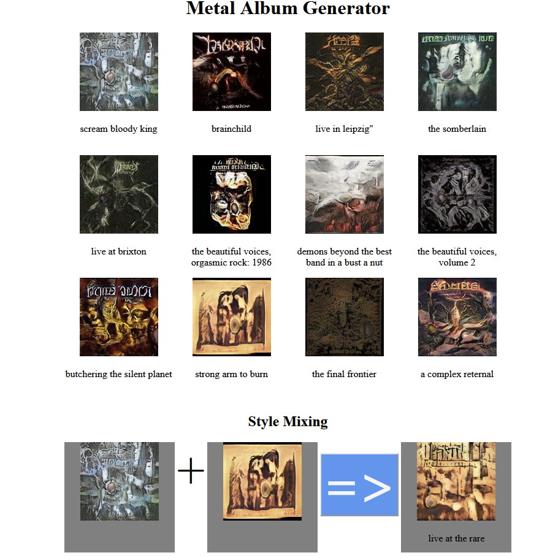

# Metal Album Cover Art and Title Generation

This project is about generating album cover art using [StyleGAN](https://github.com/NVlabs/stylegan) trained on a dataset of metal cover arts, and generating titles using an image captioning model.

Includes a simple Flask web application for generating samples and style mixing.

The training data (cover images and album titles) is automatically gathered from the publicly available databases of [MusicBrainz](https://musicbrainz.org/) and [Cover Art Archive](https://coverartarchive.org/).

Title generation via image captioning is modeled by a pretrained ResNet as the encoder and a character-level LSTM as the decoder.

## Generated Example Cover Arts (Uncurated)

## A Screenshot of the Web Application
