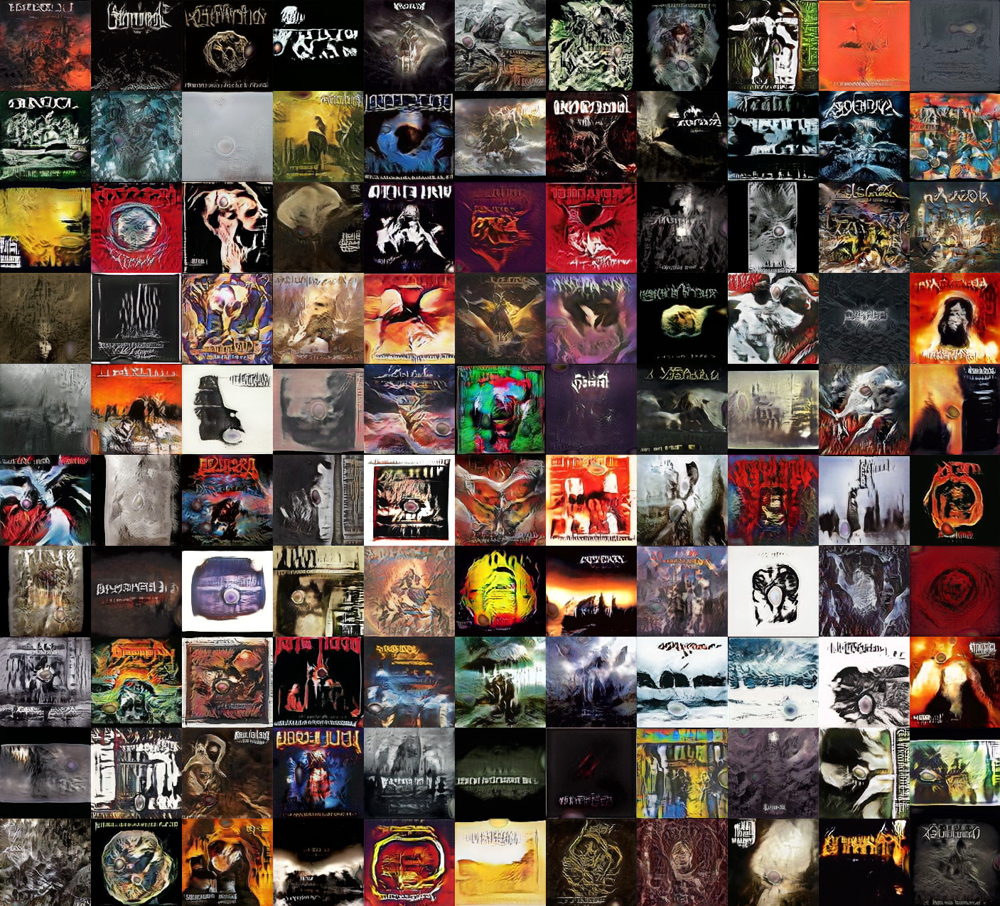

# Metal Album Cover Art and Title Generation

This project is about generating album cover art using [StyleGAN](https://github.com/NVlabs/stylegan) trained on a dataset of metal cover arts and predicting titles using an image captioning model.

Includes a simple web application for generating samples and style mixing.

